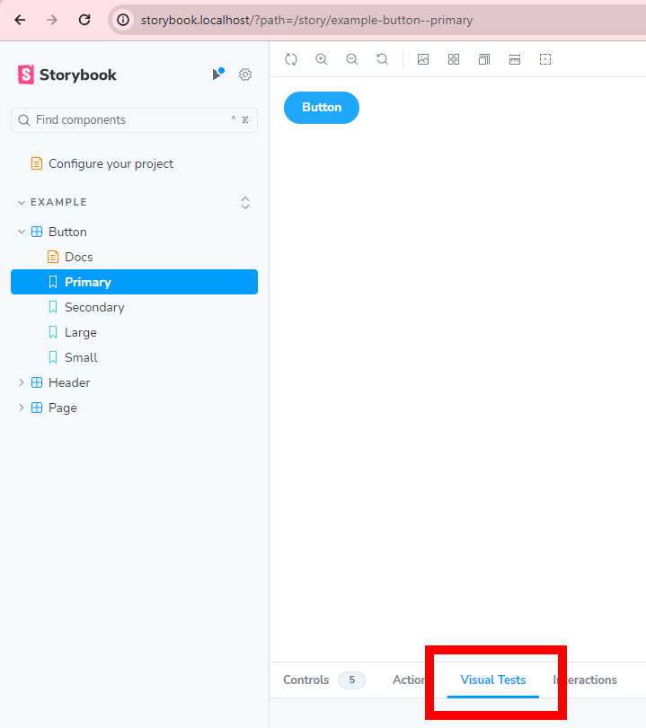

# storybook-vvd
storybook + vite + docker + our vue component library

## Knowledge
* [node.js](https://nodejs.org/en)
* [npm](https://docs.npmjs.com/)
* [Vue](https://vuejs.org/)
* [Vite](https://vitejs.dev/)
* [Docker](https://www.docker.com/)
* [Docker Compose](https://docs.docker.com/compose/)
* [GNU make](https://www.gnu.org/software/make/manual/make.html)

## Installing & Running Repository

### Prerequisites
* a [Chromatic](https://www.chromatic.com/) account
* a clone of this repository on GitHub

### Clone & Install Repository
```
git clone https://github.com/difuoan/storybook-vvd
cd storybook-vvd/
make init
```
Make sure to update the .env file with your credentials
```
CHROMATIC_PROJECT_TOKEN=chpt_XXXXXXXXXXXXXXXX
GIT_EMAIL=lucas.j.venturini@gmail.com
```

### Run Repository
```
make up
```


### Enable Visual Tests

Follow the setup process further. The next steps will be described in the "Visual Tests" panel inside the storybook UI (see screenshot &rarr;)
<br clear="right"/>


### All `make` Commands
```
init # Add default .env
up
start
down
stop
tail # get logs
build
restart
clear # Remove .env
ps # Lists containers for a Compose project, with current status and exposed ports.
```
